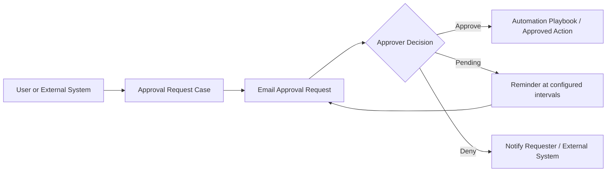

# DataRelay Grant

**Human approval before automation executes.**

DataRelay Grant is an upcoming approval and execution-control product from DataRelay Labs.

It is being designed around the patented workflow behind **US 12,056,667 B1** and **KR 10-2567118 B1**: turn a requested action into an approval case, ask the right human for an explicit decision, and allow the corresponding automated action to proceed only when the approval result permits it.

<Warning>
**Coming Soon.** DataRelay Grant is currently in the pre-release product-definition stage. Public implementation details, APIs, deployment guidance, and release artifacts have not yet been announced.
</Warning>

## Why DataRelay Grant

Automation is useful only when the right actions can proceed at the right time.

Many operational tasks still need a human decision before execution: granting access, changing policy, activating a workflow, releasing data, running an administrative action, or allowing another system to continue.

DataRelay Grant is intended to place a reusable approval layer between **request** and **execution**.

> **Request → Human Approval → Controlled Execution**

## Patent-based workflow

The underlying invention describes an approval-management flow with the following core behavior:

The issued patent material describes:

- approval-request cases created from user input or an external-system API request;
- email delivery of approval requests;
- explicit **approve / pending / deny** responses;
- reminder messages while a request remains pending;
- reusable case templates, approver information, and automation playbooks;
- automation playbooks built from reusable modules or unit operations;
- approved execution of the selected automation; and
- API-based exchange of approval requests and results with another system.

See [Patent Foundation](/patent-foundation) for the patent references and a more detailed product interpretation.

## Designed as an approval layer

DataRelay Grant is planned as a reusable human-authorization layer that can work with DataRelay products and external systems.

<CardGroup cols={3}>
  <Card title="DataRelay Link" icon="link">
    Planned integration point for actions that should require explicit human authorization before execution.
  </Card>
  <Card title="DataRelay Control" icon="route">
    Planned integration point for governed data-operation changes or actions that need an approval gate.
  </Card>
  <Card title="External Systems" icon="plug">
    The patent foundation includes API-originated approval requests and result exchange with another system.
  </Card>
</CardGroup>

DataRelay Grant is not intended to replace DataRelay Link or DataRelay Control. The planned role is to provide a common approval decision layer that those products—or other systems—can call when an operation requires human authorization.

## What is public today

| Area | Status |
| --- | --- |
| Product name | **DataRelay Grant** |
| Patent foundation | **US 12,056,667 B1 / KR 10-2567118 B1** |
| Product definition | In progress |
| Public implementation | Not yet released |
| Public API | Not yet released |
| Deployment model | Not yet announced |
| GA release | Coming Soon |

## Patent references

- [US 12,056,667 B1 — System for managing approval request using email and the operating method thereof](https://patents.google.com/patent/US12056667B1/en)
- [KR 10-2567118 B1 — 전자메일을 사용하여 간편한 승인요청을 관리하는 시스템 및 그 동작방법](https://patents.google.com/patent/KR102567118B1/ko)

<Note>
This site summarizes the product direction and technical concepts derived from the patent material. It is not a legal interpretation of patent scope. The official patent records and issued claims control the legal scope.
</Note>
