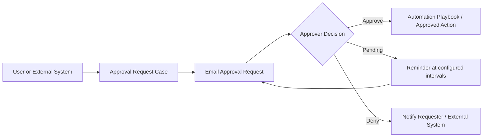

DATARELAY · HUMAN APPROVAL CONTROL

# DataRelay Grant

**Human approval before automation executes.**

DataRelay Grant is an upcoming DataRelay Labs product for human approval before automated actions run.

  <a className="dr-button dr-button-primary" href="/patent-foundation">Patent foundation</a>
  <a className="dr-button dr-button-secondary" href="https://datarelay.run/">DataRelay Labs</a>

  <a href="https://datarelay.run/">DataRelay</a>
  <a href="https://link.datarelay.run/">Link</a>
  <a href="https://control.datarelay.run/">Control</a>
  Grant
  <a href="https://engineering.datarelay.run/">Engineering</a>

It builds on the patented workflow behind **US 12,056,667 B1** and **KR 10-2567118 B1**: create an approval case for a requested action, ask the designated approver for a clear decision, and continue with the automated action only when that decision allows it.

<Warning>
**Coming Soon.** DataRelay Grant is currently in the pre-release product-definition stage. Public implementation details, APIs, deployment guidance, and release artifacts have not yet been announced.
</Warning>

## Why DataRelay Grant

Automation is useful only when the right actions can proceed at the right time.

Many operational tasks still need a human decision before execution: granting access, changing policy, activating a workflow, releasing data, running an administrative action, or allowing another system to continue.

DataRelay Grant adds a reusable human-approval step between **request** and **execution**.

> **Request → Human Approval → Controlled Execution**

## Patent-based workflow

The underlying invention describes an approval-management flow with the following core behavior:

```mermaid
flowchart LR
  A[User or External System] --> B[Approval Request Case]
  B --> C[Email Approval Request]
  C --> D{Approver Decision}
  D -->|Approve| E[Automation Playbook / Approved Action]
  D -->|Pending| F[Reminder at configured intervals]
  F --> C
  D -->|Deny| G[Notify Requester / External System]
```

The issued patent material describes:

- approval-request cases created from user input or an external-system API request;
- email delivery of approval requests;
- explicit **approve / pending / deny** responses;
- reminder messages while a request remains pending;
- reusable case templates, approver information, and automation playbooks;
- automation playbooks built from reusable modules or unit operations;
- approved execution of the selected automation; and
- API-based exchange of approval requests and results with another system.

See [Patent Foundation](/patent-foundation) for the patent references and a more detailed product interpretation.

## Where Grant fits

DataRelay Grant is intended to provide a reusable approval step for DataRelay products and external systems.

<CardGroup cols={3}>
  <Card title="DataRelay Link" icon="link">
    Planned integration point for actions that should require explicit human authorization before execution.
  </Card>
  <Card title="DataRelay Control" icon="route">
    Planned integration point for governed data-operation changes or actions that need an approval gate.
  </Card>
  <Card title="External Systems" icon="plug">
    The patent foundation includes API-originated approval requests and result exchange with another system.
  </Card>
</CardGroup>

DataRelay Grant is not intended to replace DataRelay Link or DataRelay Control. Its role is to let those products—or other systems—request a human decision before an operation continues.

## What is public today

| Area | Status |
| --- | --- |
| Product name | **DataRelay Grant** |
| Patent foundation | **US 12,056,667 B1 / KR 10-2567118 B1** |
| Product definition | In progress |
| Public implementation | Not yet released |
| Public API | Not yet released |
| Deployment model | Not yet announced |
| GA release | Coming Soon |

## Patent references

- [US 12,056,667 B1 — System for managing approval request using email and the operating method thereof](https://patents.google.com/patent/US12056667B1/en)
- [KR 10-2567118 B1 — 전자메일을 사용하여 간편한 승인요청을 관리하는 시스템 및 그 동작방법](https://patents.google.com/patent/KR102567118B1/ko)

<Note>
This site explains the planned product and the technical concepts drawn from the patent material. It is not a legal interpretation of patent scope; the official patent records and issued claims govern the legal scope.
</Note>
