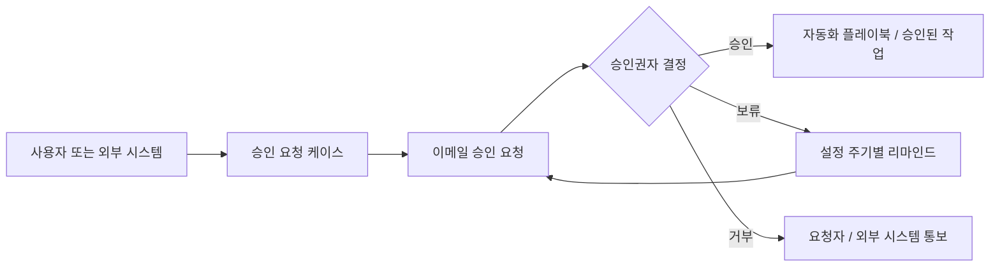

# DataRelay Grant

**자동화가 실행되기 전에 사람의 승인을 거치게 합니다.**

DataRelay Grant는 DataRelay Labs가 준비 중인 **승인 기반 자동화 및 실행 제어 제품**입니다.

제품의 출발점은 **US 12,056,667 B1** 및 **KR 10-2567118 B1**에 설명된 특허 기술입니다. 요청된 작업을 승인 케이스로 만들고, 적절한 승인권자에게 명확한 결정을 요청한 뒤, 승인 결과가 허용하는 경우에만 연결된 자동화 또는 외부 시스템 작업이 진행되도록 하는 구조입니다.

<Warning>
**Coming Soon.** DataRelay Grant는 현재 제품 정의 단계입니다. 공개 구현, API, 배포 방식, 릴리스 아티팩트는 아직 발표되지 않았습니다.
</Warning>

## DataRelay Grant가 해결하려는 문제

자동화가 많아질수록 모든 작업을 무조건 자동 실행하는 것이 아니라, 중요한 작업 앞에는 사람이 최종 결정을 내릴 수 있는 명확한 승인 지점이 필요합니다.

접근 권한 부여, 정책 변경, 워크플로우 활성화, 데이터 관련 작업, 관리 작업처럼 실행 전에 사람의 판단이 필요한 동작에 공통 승인 계층을 제공하는 것이 DataRelay Grant의 방향입니다.

> **요청 → 사람의 승인 → 통제된 실행**

## 특허 기반 동작 구조

특허 문서에는 다음과 같은 핵심 구조가 포함됩니다.

- 사용자 입력 또는 외부 시스템 API 요청으로 승인 케이스 생성
- 이메일을 통한 승인 요청 전달
- 명시적인 **승인 / 보류 / 거부** 응답
- 보류 상태에서 설정된 주기별 승인 독촉
- 케이스 템플릿, 승인권자 정보, 자동화 시나리오 / 플레이북
- 재사용 가능한 모듈 또는 단위 작업의 조합으로 자동화 구성
- 승인 결과에 따라 선택된 자동화 실행
- 외부 시스템과 API로 승인 요청 및 결과 교환

자세한 내용은 [특허 기반 기술](/ko/patent-foundation)을 참고하십시오.

## 공통 승인 계층으로의 제품 방향

DataRelay Grant는 DataRelay 제품과 외부 시스템이 공통으로 사용할 수 있는 사람 중심의 승인 계층을 목표로 합니다.

<CardGroup cols={3}>
  <Card title="DataRelay Link" icon="link">
    실행 전에 명시적인 사람의 승인이 필요한 작업을 위한 향후 연동 지점입니다.
  </Card>
  <Card title="DataRelay Control" icon="route">
    데이터 운영 변경 또는 실행에 승인 게이트가 필요한 경우를 위한 향후 연동 지점입니다.
  </Card>
  <Card title="외부 시스템" icon="plug">
    특허에는 외부 시스템이 API로 승인 요청을 생성하고 결과를 전달받는 구조가 포함됩니다.
  </Card>
</CardGroup>

DataRelay Grant는 DataRelay Link나 DataRelay Control을 대체하는 제품이 아닙니다. 이들 제품 또는 다른 시스템이 중요한 작업을 수행하기 전에 공통으로 호출할 수 있는 **승인 결정 계층**이 되는 것이 제품 방향입니다.

## 현재 공개 상태

| 항목 | 상태 |
| --- | --- |
| 제품명 | **DataRelay Grant** |
| 특허 기반 | **US 12,056,667 B1 / KR 10-2567118 B1** |
| 제품 정의 | 진행 중 |
| 공개 구현 | 아직 미출시 |
| 공개 API | 아직 미출시 |
| 배포 모델 | 아직 미발표 |
| GA | Coming Soon |

## 특허 원문

- [US 12,056,667 B1 — System for managing approval request using email and the operating method thereof](https://patents.google.com/patent/US12056667B1/en)
- [KR 10-2567118 B1 — 전자메일을 사용하여 간편한 승인요청을 관리하는 시스템 및 그 동작방법](https://patents.google.com/patent/KR102567118B1/ko)

<Note>
이 사이트는 특허 문서를 바탕으로 제품 방향과 기술 개념을 요약한 것이며 법률적 해석이 아닙니다. 특허의 법적 범위는 공식 등록공보와 청구항을 기준으로 판단해야 합니다.
</Note>
